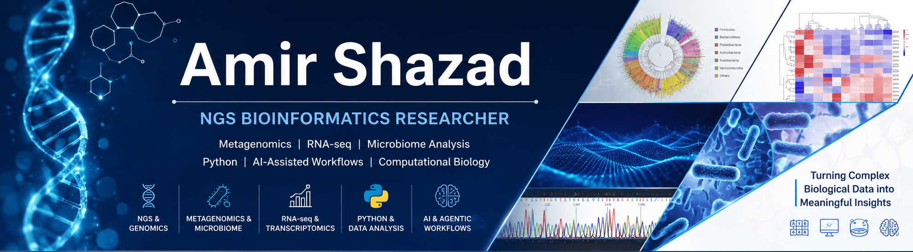

  

# Hi, I’m Amir Shazad 👋

### NGS Bioinformatics | Metagenomics | RNA-seq | Microbiome Data Analysis | Python | AI-Assisted Workflows

  
  
  
  
  

---

## 👨‍🔬 About Me

I am a PhD researcher in **Food Engineering and Biotechnology** with a growing focus on **NGS bioinformatics, metagenomics, RNA-seq, microbiome data analysis, Python-based omics workflows, and AI-assisted computational biology**.

My background connects **food biotechnology, fermentation, microbiome science, functional foods, molecular microbiology, analytical science, and computational biology**. I am especially interested in using bioinformatics and AI-supported workflows to transform complex biological datasets into meaningful scientific interpretation.

My goal is to build practical, reproducible, and biologically meaningful workflows that connect **wet-lab research, sequencing data, computational analysis, and real-world scientific applications**.

---

## 🔬 Main Bioinformatics Interests

| Area                     | Focus                                                           |
| ------------------------ | --------------------------------------------------------------- |
| **NGS Bioinformatics**   | FASTQ, BAM, CRAM, VCF, QC, alignment, reproducible workflows    |
| **Metagenomics**         | 16S rRNA, microbiome profiling, alpha and beta diversity        |
| **Transcriptomics**      | RNA-seq, count matrices, differential gene expression           |
| **Genomics**             | WGS/WES, SNPs, indels, CNVs, SVs, variant calling concepts      |
| **Multi-omics**          | Microbiome–metabolite integration and biological interpretation |
| **AI-assisted Research** | Claude Code, ChatGPT, Cursor, GitHub Copilot, AI agents         |

---

## 🧬 NGS and Omics Skills I Am Building

### Genomics

* Whole Genome Sequencing (WGS)
* Whole Exome Sequencing (WES)
* FASTQ quality control
* Read trimming and preprocessing
* Short-read alignment
* BAM and CRAM processing
* Variant calling concepts
* SNPs, indels, CNVs, and structural variants
* VCF file interpretation and filtering

### Transcriptomics

* RNA-seq preprocessing
* Short-read RNA-seq workflows
* Gene and transcript quantification
* Count matrix generation
* Differential gene expression analysis
* Volcano plots, PCA, heatmaps, and expression visualization
* Functional enrichment concepts including GO and KEGG

### Metagenomics and Microbiome

* 16S rRNA sequencing analysis
* Amplicon sequence variants and taxonomic profiling
* Alpha diversity analysis
* Beta diversity analysis
* Microbiome composition visualization
* Differential abundance concepts
* Microbiome–metabolite integration
* Gut microbiome and functional food research applications

---

## 🧰 Tools and Technologies

### Programming and Data Analysis

  
  
  
  
  
  
  
  

### NGS and Bioinformatics Tools

  
  
  
  
  
  
  
  
  
  
  
  
  
  
  
  

### AI, Coding Assistants and Agentic Workflows

  
  
  
  
  

I am exploring how modern AI tools can support **bioinformatics, coding, documentation, workflow planning, debugging, literature review, and research automation**.

---

## 🤖 AI-Assisted Bioinformatics Focus

I am interested in using AI and agentic workflows for:

* Automating repetitive NGS data analysis steps
* Summarizing FastQC and MultiQC reports
* Creating structured workflow documentation
* Supporting RNA-seq and metagenomics pipeline planning
* Generating clear explanations of bioinformatics outputs
* Assisting with Python and Bash scripting
* Building reproducible research notes
* Connecting biological questions with computational workflows
* Improving productivity in omics-based research

My goal is to combine **bioinformatics + Python + AI + automation** to build practical, reproducible, and easy-to-understand workflows for biological data analysis.

---

## 📌 What I Share on This GitHub

This GitHub profile is focused on building and documenting practical learning projects related to:

* NGS file format understanding
* FASTQ, BAM, CRAM, VCF, and count matrix handling
* Sequencing quality control workflows
* Microbiome and metagenomics analysis
* Alpha and beta diversity workflows
* RNA-seq preprocessing and interpretation
* Python scripts for biological data analysis
* Data visualization for biological datasets
* AI-assisted bioinformatics notes
* Agentic workflow ideas for research automation
* Step-by-step bioinformatics learning resources for students and researchers

---

## 🚀 Current Learning Goals

I am currently developing a strong portfolio in:

* NGS data analysis
* Microbiome bioinformatics
* RNA-seq workflows
* Python for biological data
* Reproducible research documentation
* AI-assisted computational biology
* Agentic workflows for research and data analysis

My long-term goal is to apply these skills to **microbiome research, functional foods, genomics, transcriptomics, food biotechnology, and health-focused omics research**.

---

## 🧪 Research Background

My academic and research background includes:

* Food Engineering and Biotechnology
* Fermentation and functional foods
* Microbiome and gut health research
* Microbiome–gut–brain axis concepts
* Molecular microbiology
* Cell-based models
* Analytical chemistry of complex food matrices
* Bioactive compounds and metabolite analysis
* Food safety, quality assurance, and regulatory compliance

This background helps me connect biological questions with computational analysis, especially in microbiome-related and functional food research.

---

## 📊 Example Project Areas

Some practical bioinformatics projects I aim to build and document here include:

| Project Area              | Example Output                                       |
| ------------------------- | ---------------------------------------------------- |
| **Linux for NGS**         | Basic command-line workflows for beginners           |
| **FASTQ QC**              | FastQC and MultiQC reports                           |
| **Microbiome Analysis**   | Alpha diversity, beta diversity, and taxa plots      |
| **RNA-seq Basics**        | Count matrix exploration and visualization           |
| **Python for Biology**    | Scripts for cleaning and plotting biological data    |
| **Variant Calling Notes** | VCF understanding and filtering examples             |
| **AI-assisted Workflows** | Pipeline documentation and research automation notes |

---

## 💡 My Approach

I believe bioinformatics should be:

* Reproducible
* Well documented
* Biologically meaningful
* Easy to explain
* Connected to real research questions
* Supported by clean data analysis
* Improved with responsible use of AI tools

For me, the goal is not only to run pipelines, but also to understand what each step means biologically.

---

## 📫 Open to Collaboration

I am open to collaboration in:

* NGS bioinformatics
* Metagenomics
* RNA-seq
* Microbiome data analysis
* Functional food research
* Food biotechnology
* AI-assisted research workflows
* Python-based biological data analysis
* Bioinformatics learning resources

---

## 🔗 Keywords

`NGS` `Bioinformatics` `Metagenomics` `Microbiome` `RNA-seq` `Python` `Linux` `FASTQ` `BAM` `VCF` `QIIME2` `FastQC` `MultiQC` `Variant Calling` `Alpha Diversity` `Beta Diversity` `Claude Code` `ChatGPT` `Cursor` `GitHub Copilot` `AI Agents` `Agentic Workflows` `Computational Biology`

---

### Building reproducible bioinformatics workflows for microbiome, omics, and AI-assisted research.

